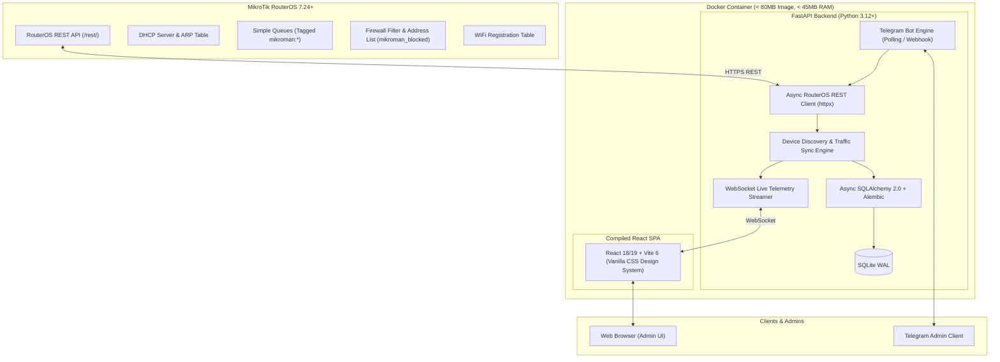
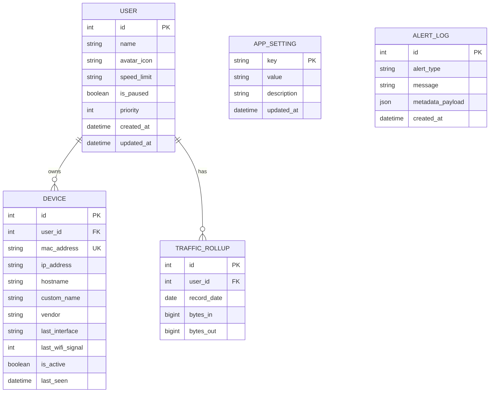

# MikroTik Companion Docker Application Design Specification

**Date:** 2026-08-28  
**Status:** Approved  
**Target Environment:** MikroTik RouterOS 7.24+ Container Engine & Standard Docker / Docker Compose  

---

## 1. Executive Summary & Goals

The MikroTik Companion (**MikroMan**) is an ultra-lightweight, high-performance Docker companion application designed to run seamlessly inside the RouterOS 7.24+ `/container` subsystem or on an external Docker host.

### Core Objectives:
1. **Per-User Traffic Monitoring & Analytics:** Aggregate multiple devices (MAC/IP) under user profiles and track real-time upload/download speeds and cumulative data usage.
2. **Instant Traffic Control:** Provide granular speed throttling (via RouterOS Simple Queues) and one-click internet pause/blocking (via dynamic RouterOS Firewall Address Lists).
3. **Bilingual React Dashboard:** High-aesthetic, responsive SPA featuring native **RouterOS Dark** (WinBox slate/blue) and **RouterOS Light** (WebFig) color themes, with full English (`en`) and Russian (`ru`) localization.
4. **Dual-Mode Telegram Bot:** Full router telemetry, remote user traffic management, and proactive alerting supporting both **Long Polling** (zero-config behind NAT) and **Webhooks**.
5. **Low Footprint & Zero Router Strain:** Strict resource optimization (< 45MB RAM, low CPU overhead, throttled SQLite WAL writes to preserve flash storage).

---

## 2. System Architecture

---

## 3. Backend Architecture & Data Model

### 3.1 Stack
* **Runtime:** Python 3.12+
* **Framework:** FastAPI 0.115+
* **Serialization & Validation:** Pydantic v2.10+ models for all request/response schemas
* **Database & ORM:** SQLite with async SQLAlchemy 2.0+ and Alembic database migrations
* **HTTP & RouterOS Client:** `httpx.AsyncClient` with custom session management, TLS certificate verification options, and automatic retry backoff.
* **Telegram Framework:** `aiogram` 3.17+ running as an async background task supporting both Polling and Webhook modes.

### 3.2 Database Schema (SQLite + Alembic)

---

## 4. MikroTik Integration & Traffic Control Engine

### 4.1 Device Discovery & Inventory Sync
1. **Periodic Lease & ARP Scan (Every 10s):**
   * Queries `/ip/dhcp-server/lease` and `/ip/arp`.
   * Correlates MAC, active IP, client hostname, and lease status.
   * Resolves hardware vendor via offline OUI lookup table.
   * If wireless, queries `/interface/wifi/registration-table` for live signal dBm and connected SSID.
2. **Automatic Device Provisioning:**
   * Newly detected MACs are placed in the "Unassigned Devices" inbox.
   * Generates a "New Device Connected" notification if alerts are enabled.

### 4.2 Traffic Monitoring Mechanism
* For each user profile with assigned devices, the engine manages a dedicated Simple Queue on RouterOS:
  * Name: `mikroman-user-<id>`
  * Target: comma-separated list of active IP addresses for that user's devices (e.g. `192.168.88.15/32,192.168.88.16/32`).
  * Comment: `mikroman:managed:user_<id>`
* Every 1–2 seconds during active WebSocket sessions (or 10s during background polling):
  * Queries `GET /rest/queue/simple` to extract instantaneous `rate` (bps up/down) and cumulative `bytes` (bytes up/down).
  * Streams real-time rates to active web clients over WebSockets.
  * Flushes periodic rollups (hourly/daily) to SQLite, minimizing NAND flash write frequency.

### 4.3 Traffic Control Actions
* **Bandwidth Throttling:**
  * Modifies `max-limit` on the user's Simple Queue (e.g., `10M/50M` for 10Mbps upload / 50Mbps download).
  * Setting "Unlimited" clears or sets `0/0` limit.
* **Instant Internet Pause / Block:**
  * Uses RouterOS `/ip/firewall/address-list` (`list=mikroman_blocked`).
  * Companion checks/provisions a single firewall filter rule:
    `chain=forward action=drop src-address-list=mikroman_blocked comment="mikroman:drop_blocked_users"`
  * Pausing a user adds their active IP addresses to `mikroman_blocked` with `timeout=none` or specified duration.
* **Non-Destructive Guarantee:**
  * The engine strictly filters by `comment="mikroman:*"` and will never alter, overwrite, or delete any manual user-defined queues or firewall rules on RouterOS.

---

## 5. React Web Dashboard & Design System

### 5.1 Architecture
* Built with **React 18/19 + Vite 6**.
* Fully responsive Single Page Application (Desktop, Tablet, Mobile).
* State management with React Query / Context for real-time WebSocket telemetry.

### 5.2 RouterOS Aesthetic & Theming
* **Dark Theme (Default):** Inspired by WinBox/RouterOS dark UI:
  * Background: `#16191f`, Surface/Cards: `#1f242d`, Border: `#2e3542`
  * Primary Accent: MikroTik Blue `#0b72c9` / `#2392ec`
  * Status Colors: Connected Green `#27ae60`, Warning Orange `#f39c12`, Alert Red `#e74c3c`
* **Light Theme:** Inspired by RouterOS WebFig:
  * Background: `#f2f4f7`, Surface/Cards: `#ffffff`, Border: `#d8dee9`
  * Primary Accent: Slate Blue `#1e5f99`
* Instant toggle switch in navigation header with auto-detection of `prefers-color-scheme`.

### 5.3 Bilingual Internationalization (i18n)
* Complete localization for English (`en`) and Russian (`ru`).
* Instant language switcher in header.
* Localized strings for all metrics, tooltips, dialogs, and error messages.

### 5.4 Dashboard Views
1. **Header Live Telemetry Bar:**
   * Router Model, OS version, CPU load %, RAM %, Board Temp (°C), Active WAN IP, Live Aggregate Gateway Speed (TX/RX).
2. **Users & Traffic View (Main):**
   * User cards showing profile avatar, active device pills with WiFi signal dBm, live RX/TX speedometers, and today's total data consumption.
   * Direct control buttons: `[ ⏸ Pause / ▶ Resume ]`, `[ Speed Limit Dropdown ]`, `[ ⚙ Manage Devices ]`.
3. **Unassigned Devices Inbox:**
   * List of newly discovered network devices with vendor logos and one-click user assignment.
4. **Router Health & Interfaces:**
   * Port status matrix (Ethernet link speed, PoE, active wireless client counts).
5. **Settings & Integrations:**
   * RouterOS API connection test & credentials.
   * Telegram Bot configuration (Bot Token, Admin Chat IDs, Polling/Webhook toggle).
   * Alert threshold settings (CPU %, Temp, Traffic limits).

---

## 6. Telegram Bot Engine

### 6.1 Dual Connection Modes
1. **Long Polling (Default):** Zero configuration, works immediately behind NAT, no public SSL certificate required.
2. **Webhook Mode:** Configurable via Web UI settings or environment variables (`TELEGRAM_WEBHOOK_URL`). FastAPI exposes `/api/v1/telegram/webhook` to handle updates.

### 6.2 Authorization & Security
* Strict validation of sender against configured `TELEGRAM_ADMIN_CHAT_IDS`.
* Unauthorized attempts are logged and ignored.

### 6.3 Bilingual Commands (EN / RU)
* `/status` — Snapshot of router health, CPU, RAM, temperature, WAN IP, and total live throughput.
* `/users` — List of all users, current speeds, consumed traffic today, with interactive inline keyboard buttons for speed limiting and pausing.
* `/pause <user>` & `/resume <user>` — Toggle internet access for a specific user.
* `/limit <user> <speed>` — Apply a rate limit (e.g. `/limit alex 20M` or `/limit alex unlimited`).
* `/reboot` — Interactive 2-step confirmation to reboot the router.

### 6.4 Proactive Event Alerts
* **New Device Discovery:** Sends notification with MAC, vendor, hostname, IP, and an inline `[ ➕ Assign to User ]` button.
* **Resource Warning:** High CPU (>90%) or high temperature threshold.
* **WAN IP Change:** Alerts whenever ISP assigns a new public IP.
* **Daily Report (Optional):** Scheduled summary at 23:59 with top bandwidth users.

---

## 7. Verification & Testing Strategy

### 7.1 Automated Testing
* **Backend:**
  * `pytest` + `pytest-asyncio` covering all API endpoints, Pydantic schemas, and database operations.
  * Mock RouterOS REST API test suite simulating RouterOS 7.24+ responses (DHCP leases, queues, health metrics).
  * Alembic migration test suite (upgrade/downgrade validation).
* **Frontend:**
  * Component testing with `vitest` + React Testing Library.
  * Theme switching and i18n localization dictionary completeness tests.

### 7.2 Container Verification
* Multi-stage Docker build testing (`linux/amd64`, `linux/arm64`, `linux/arm/v7`).
* Resource consumption benchmark verifying RAM usage < 45MB during active polling.
